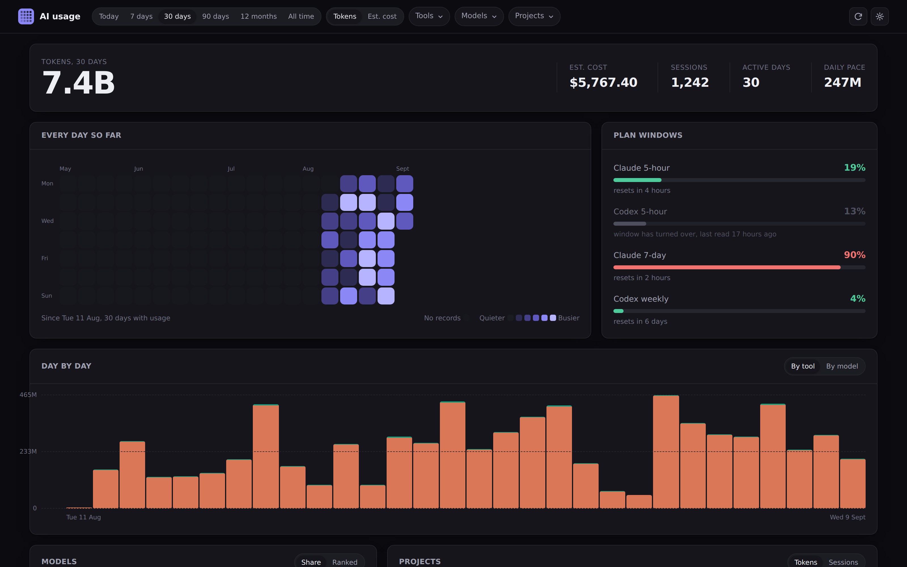

<h1 align="center">AI usage dashboard 📊</h1>
<p align="center">
<i>Every token your AI coding tools have spent, off the transcripts already on your machine</i>
</p>

<p align="center">
  
</p>

---

## About

Claude Code, Codex and friends all leave a paper trail. A JSONL transcript per session, token
counts on every turn, and in Codex's case the rate-limit windows too. Nothing reads them, so you
end up guessing what a week of agents actually cost you.

This reads those files, keeps a copy in a small SQLite database, and draws the lot:

- a calendar heatmap of every day since your records start
- daily totals, stacked by tool or by model
- the split between fresh input, output, cache reads and cache writes
- which projects and models the tokens went to
- your Claude 5-hour and 7-day windows, and the Codex ones
- every session, with what it spent and how long it ran

The database matters more than it sounds like it should. Claude Code prunes its transcripts after
a week or two, so anything not copied out is gone. Once this has been running a while its history
goes back futher than the files do.

Cost is an estimate at published API rates. If you're on a subscription thats a weight rather
than a bill, and the plan windows are the thing really constraining you. A model we have no
price for is reported as unpriced, never quietly counted as free.

---

## Usage

```shell
npx ai-usage-dashboard
```

That's it. It finds your transcripts, reads them, and opens on
[localhost:4747](http://localhost:4747). Nothing leaves the machine except the one call to
Anthropic for your plan windows, which you can turn off in settings.

| Flag                   | What it does                                     |
| ---------------------- | ------------------------------------------------ |
| `-p, --port <n>`       | Port to listen on, or the next free one after it |
| `-h, --host <ip>`      | Address to bind, `127.0.0.1` by default          |
| `--db <path>`          | Where to keep the history                        |
| `--open` / `--no-open` | Whether to open a browser                        |

---

## Deployment

### Option 1: Docker

The image is on DockerHub ([`notaflightrisk/ai-usage-dashboard`](https://hub.docker.com/r/notaflightrisk/ai-usage-dashboard))
and GHCR. Mount the directories you want read, plus somehwere to keep the database:

```shell
docker run -p 8080:8080 \
  -v ~/.claude:/home/node/.claude:ro \
  -v ~/.codex:/home/node/.codex:ro \
  -v ai-usage:/data \
  notaflightrisk/ai-usage-dashboard
```

### Option 2: A local service

There's a systemd user unit in `scripts/`. `scripts/install.sh` fills in the paths and starts it,
so it comes back after a reboot:

```shell
./scripts/install.sh 4747
```

### Option 3: From a release

Grab the tarball from [releases](https://github.com/NotAFlightRisk/ai-usage-dashboard/releases),
then `npm ci --omit=dev && npm start`.

### Option 4: From source

Follow [Development](#development) below, then `npm run build && npm start`.

No hosted deploy, and there won't be one. It reads files on your machine, so somebody else's
server would have nothing to look at.

---

## Configuration

Most of it lives behind the gear icon: theme, default range, how often to rescan, whether to ask
Anthropic for your plan windows, and price overrides for any model we've got wrong or don't know.

Paths are environment variables, since they're needed before the app starts. See
[`.env.example`](../.env.example) for the full list. The ones you'll actually want are
`AIUSAGE_DB`, `AIUSAGE_CLAUDE_DIR` and `AIUSAGE_CODEX_DIR`.

---

## Supported tools

| Tool        | Where it reads                                                 |
| ----------- | -------------------------------------------------------------- |
| Claude Code | `~/.claude/projects/**/*.jsonl`, subagent transcripts included |
| Codex       | `~/.codex/sessions/**/*.jsonl`                                 |
| OpenCode    | `~/.local/share/opencode/storage/message`                      |

Adding another is one file in `src/lib/server/sources/`. If a tool writes token counts somewhere
we can read, it can go in - open an issue with a sample and we'll have a look.

---

## Development

You'll need [Node](https://nodejs.org/) 22.12 or newer (that's where `node:sqlite` lands), plus
[Git](https://git-scm.com/). It's a [SvelteKit](https://svelte.dev/docs/kit) app with no runtime
dependencies beyond the Node adapter, so there's nothing else to install.

```bash
git clone git@github.com:NotAFlightRisk/ai-usage-dashboard.git
cd ai-usage-dashboard
npm install
npm run dev
```

The dev server is then on [localhost:5173](http://localhost:5173). The other scripts you'll want
are `npm run check` (types), `npm test` (tests) and `npm run format`.

Provider logos come from [Simple Icons](https://simpleicons.org), which is CC0. The marks
themselves belong to their owners and are only used to point at them.

---

<!-- License + Copyright -->
<p  align="center">
  <a href="https://github.com/NotAFlightRisk"></a><br>
  <sup>
    <i>Licensed under <a href="../LICENSE">MIT</a>, © <a href="https://peng.ly">NotAFlightRisk</a> 2026</i>
  </sup>
</p>
